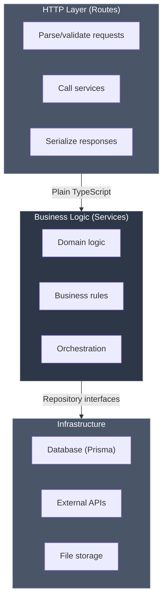

# Architecture Philosophy

## Framework as a Detail

Glasswork is built on a fundamental principle: **the framework is a detail at the edges of your application**.

Your business logic should never know it's running in Glasswork. Your services should be portable to CLI tools, background jobs, or any other context. Only your routes, the thin adapters at the boundary, should touch the framework.

## Why This Matters

Traditional frameworks often lead to tight coupling that creates long-term maintenance problems:

- Can't test business logic without framework test helpers
- Can't reuse services in different contexts (CLI, jobs)
- Framework upgrades cascade through the entire codebase
- Swapping frameworks requires rewriting business logic

Glasswork tries to solve this with a clean, layered architecture.

## The Three Layers



| Layer | Framework Coupling | Responsibility |
|-------|-------------------|----------------|
| **Routes** | ✅ Glasswork/Hono | Thin HTTP adapters (5-7 lines) |
| **Services** | ❌ None | Pure business logic, portable |
| **Infrastructure** | ✅ Prisma, AWS SDK | Database, external services |

## Rule 1: Business Logic is Independent

Services have **zero framework imports**:

```typescript
// ✅ GOOD: Framework-agnostic service
export class AuthService {
  constructor({
    prismaService,
    hashService,
  }: {
    prismaService: PrismaService;
    hashService: HashService;
  }) {
    this.prismaService = prismaService;
    this.hashService = hashService;
  }

  async startSession(email: string): Promise<SessionResult> {
    // Pure business logic
    // No knowledge of HTTP, routes, Hono, or framework
    const user = await this.prismaService.user.findUnique({ where: { email } });
    if (!user) throw new NotFoundException('User not found');

    return { email: user.email, token: generateToken(user.id) };
  }
}

::: tip A Note on Exceptions
You might notice `NotFoundException` is imported from `glasswork`. This is a pragmatic trade-off: these exceptions are simple JavaScript classes with no side effects. If you require strict zero-dependency purity, you can define your own error classes and map them in the error handler. See [Decoupling Services](/guide/error-handling#decoupling-services).
:::
```

```typescript
// ❌ BAD: Service knows about HTTP
export class AuthService {
  async startSession(req: HonoRequest): Promise<HonoResponse> {
    const body = await req.json(); // HTTP concern!
    return c.json({ email }); // HTTP concern!
  }
}
```

## Rule 2: Routes are Thin Adapters

Routes should **only** adapt HTTP to service calls:

```typescript
// ✅ GOOD: Thin route adapter (5-7 lines)
router.post('/session', ...route({
  body: StartSessionDto,
  handler: ({ body, services }) => {
    return services.authService.startSession(body.email);
  },
}));
```

```typescript
// ❌ BAD: Business logic in route
router.post('/session', async (c) => {
  const { email } = await c.req.json();

  // All this is business logic - should be in service!
  const user = await prisma.user.findUnique({ where: { email } });
  if (!user) throw new NotFoundError();

  const code = generateCode();
  await emailService.send(email, code);

  return c.json({ email });
});
```

## Testing Benefits

### Business Logic: No Framework Mocking

```typescript
describe('AuthService', () => {
  it('should throw when user not found', async () => {
    // Simple mocks - no framework knowledge needed
    const mockUserRepo = {
      findByEmail: vi.fn().mockResolvedValue(null),
    };

    const authService = new AuthService({
      userRepo: mockUserRepo,
      hashService: mockHashService,
    });

    // Pure business logic test
    await expect(
      authService.startSession('test@example.com')
    ).rejects.toThrow('User not found');

    // No Hono mocking, no HTTP mocking, no framework mocking!
  });
});
```

## Portability Benefits

### Scenario: Reuse in CLI Tool

Because services are framework-agnostic, you can use them anywhere:

```typescript
// Same service, different context
import { AuthService } from './services/auth.service';

const cli = createCommand('auth')
  .command('create-session')
  .argument('<email>')
  .action(async (email) => {
    const authService = container.resolve(AuthService);
    const result = await authService.startSession(email);
    console.log(`Session created: ${result.token}`);
  });
```

Your `AuthService` works in:

- HTTP requests (via Glasswork routes)
- CLI tools
- Background jobs
- Test suites
- **Anywhere TypeScript runs**

## Why No Decorators?

While decorators (like in NestJS) keep framework code out of business logic, they have drawbacks for serverless:

**Technical Issues:**

- Require `reflect-metadata` (~50-100KB overhead)
- Poor esbuild optimization, slower cold starts
- Experimental TypeScript feature

**Maintainability Issues:**

- Runtime behavior hidden in decorators is hard to trace
- Less reliable IDE support and refactoring
- AI assistants struggle with decorator semantics

Glasswork uses **plain functions** and **configuration objects** instead:

```typescript
// Type-safe, no decorators needed
export const authRoutes = createRoutes((router, { authService }, route) => {
  router.post('/login', ...route({
    body: LoginDto,
    responses: { 200: SessionDto },
    handler: ({ body }) => {
      // body is fully typed from LoginDto
      return authService.login(body.email, body.password);
    },
  }));
});
```

## PROXY Mode for Lambda

Glasswork uses Awilix's PROXY mode for Lambda compatibility with bundler minification:

```typescript
// PROXY Mode (verbose but works with Lambda)
export class AuthService {
  constructor({
    prismaService,
    hashService,
  }: {
    prismaService: PrismaService;
    hashService: HashService;
  }) {
    this.prismaService = prismaService;
    this.hashService = hashService;
  }
}
```

**Why?** Parameter names survive minification, enabling dependency injection with optimized bundles.

::: tip Learn More
Read about [The Transparency Principle](/core-concepts/transparency) to understand how we preserve access to underlying libraries.
:::

## Summary

Our architecture philosophy:

- ✅ Framework is a detail at the edges
- ✅ Business logic is framework-agnostic
- ✅ Pure TypeScript (no decorators)
- ✅ Easy to test (no framework mocking needed)
- ✅ Easy to port (services work anywhere)
- ✅ Long-term maintainable

This approach maximizes maintainability, testability, and portability while minimizing framework lock-in and technical debt.

## References

- [Frameworks Harm Maintenance](https://berk.es/2022/09/06/frameworks-harm-maintenance/) - Analysis of framework coupling
- [Clean Architecture](https://blog.cleancoder.com/uncle-bob/2012/08/13/the-clean-architecture.html) - Uncle Bob's principles
- [Hexagonal Architecture](https://alistair.cockburn.us/hexagonal-architecture/) - Ports and adapters
