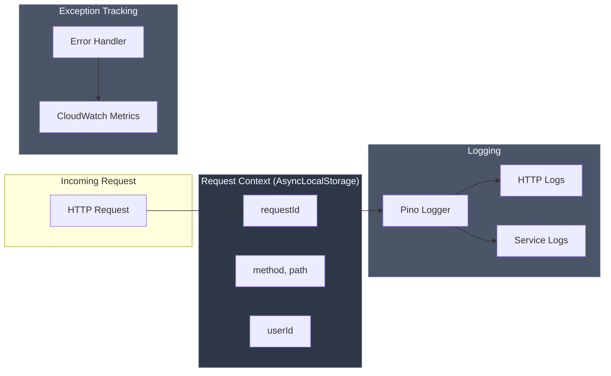

# Observability

Glasswork provides built-in observability features optimized for AWS Lambda and CloudWatch. Get structured logging, request correlation, and exception tracking with minimal configuration.

## Quick Start

Three lines to enable full observability:

```typescript
import pino from 'pino';
import { bootstrap, createCloudWatchTracker, lambdaPinoConfig } from 'glasswork';
import { AppModule } from './app.module';

const { app } = await bootstrap(AppModule, {
  logger: {
    pino: pino(lambdaPinoConfig),
  },
  exceptionTracking: {
    tracker: createCloudWatchTracker(),
  },
});
```

**This gives you:**

- ✅ Structured JSON logs optimized for CloudWatch Logs Insights
- ✅ Automatic `requestId` in all logs (via AsyncLocalStorage)
- ✅ Exception tracking for 5xx errors
- ✅ Request correlation across your entire codebase

## How It Works



When a request comes in:

1. **Request context** is stored in AsyncLocalStorage with a unique `requestId`
2. **All logs** automatically include the `requestId` - no manual passing required
3. **Exceptions** are captured with full request context

## Installation

```bash
npm install pino
```

That's it! CloudWatch integration uses the AWS SDK which is already available in Lambda.

## Logging

### Automatic Request Logging

HTTP requests are automatically logged with timing:

```json
{
  "level": "info",
  "requestId": "abc-123-def",
  "method": "POST",
  "path": "/api/users",
  "status": 201,
  "duration": 45,
  "msg": "HTTP Request"
}
```

### Service Logging

Use `getRequestId()` anywhere in your code - it works automatically:

```typescript
import { getRequestId } from 'glasswork';

export class UserService {
  constructor({ prisma }: { prisma: PrismaService }) {
    this.prisma = prisma;
  }

  private prisma: PrismaService;

  async create(data: CreateUserDto) {
    const requestId = getRequestId(); // Works automatically!

    console.log(JSON.stringify({
      requestId,
      msg: 'Creating user',
      email: data.email,
    }));

    return this.prisma.user.create({ data });
  }
}
```

### Route Handler Logger (Simplest)

Route handlers have a built-in context-aware logger:

```typescript
import { createRoutes } from 'glasswork';

export const userRoutes = createRoutes<{ userService: UserService }>(
  (router, { userService }, route) => {
    router.post('/users', ...route({
      tags: ['Users'],
      body: CreateUserDto,
      responses: { 201: UserDto },
      handler: async ({ body, logger }) => {
        // Logger uses first tag as service name, includes requestId automatically
        logger.info('Creating user', { email: body.email });
        // Output: {"requestId":"abc-123","service":"Users","email":"...","msg":"Creating user"}

        return userService.create(body);
      }
    }));
  }
);
```

### Context-Aware Logger (For Services)

For service classes, use `createContextAwarePinoLogger`:

```typescript
import pino from 'pino';
import { createContextAwarePinoLogger, lambdaPinoConfig } from 'glasswork';

// Create base Pino logger
const basePino = pino(lambdaPinoConfig);

// Create context-aware logger
const logger = createContextAwarePinoLogger({
  pino: basePino,
  service: 'user-service',
});

export class UserService {
  async create(data: CreateUserDto) {
    // requestId automatically included!
    logger.info('Creating user', { email: data.email });
    // Output: {"requestId":"abc-123","service":"user-service","email":"test@example.com","msg":"Creating user"}
  }
}
```

### User Context

Track user information after authentication:

```typescript
import { setRequestUser } from 'glasswork';

// In your auth middleware
const authMiddleware: MiddlewareHandler = async (c, next) => {
  const user = await validateToken(c.req.header('Authorization'));

  // Set user context - included in all subsequent logs
  setRequestUser(user.id);

  c.set('user', user);
  await next();
};
```

### Custom Context

Add business-specific context:

```typescript
import { setRequestContextValue } from 'glasswork';

// Add tenant ID for multi-tenant apps
setRequestContextValue('tenantId', tenant.id);

// Add any business context
setRequestContextValue('orderValue', order.total);
```

## Exception Tracking

### CloudWatch Tracker (Default)

The built-in CloudWatch tracker publishes custom metrics and logs exceptions:

```typescript
import { createCloudWatchTracker } from 'glasswork';

const tracker = createCloudWatchTracker({
  namespace: 'MyApp/Errors',  // Default: 'Application/Errors'
  dimensions: {
    environment: process.env.NODE_ENV,
    service: 'user-api',
  },
});

const { app } = await bootstrap(AppModule, {
  exceptionTracking: { tracker },
});
```

**What gets tracked:**

- `ErrorCount` metric per error type/path/status
- Full error details logged to console (appears in CloudWatch Logs)
- Request context (requestId, path, method)

**Create CloudWatch Alarms:**

```yaml
# CloudFormation example
HighErrorRateAlarm:
  Type: AWS::CloudWatch::Alarm
  Properties:
    AlarmName: my-api-high-error-rate
    MetricName: ErrorCount
    Namespace: MyApp/Errors
    Statistic: Sum
    Period: 300
    EvaluationPeriods: 2
    Threshold: 10
    ComparisonOperator: GreaterThanThreshold
```

### Console Tracker (Development)

For local development without CloudWatch:

```typescript
import { createConsoleTracker, isDevelopment } from 'glasswork';

const tracker = isDevelopment()
  ? createConsoleTracker()
  : createCloudWatchTracker();
```

### Default Tracking Behavior

By default, only **5xx errors** are tracked:

- ✅ Track: `InternalServerErrorException`, `ServiceUnavailableException`, unexpected errors
- ❌ Don't track: `NotFoundException`, `BadRequestException` (client errors)

### Custom Tracking Rules

```typescript
const { app } = await bootstrap(AppModule, {
  exceptionTracking: {
    tracker,
    // Track 5xx and 404 errors
    trackStatusCodes: (status) => status >= 500 || status === 404,
  },
});
```

### Explicit Tracking Override

Force or prevent tracking for specific exceptions:

```typescript
import { NotFoundException, InternalServerErrorException } from 'glasswork';

// Force track this 404 (normally not tracked)
throw new NotFoundException('Critical user lookup failed', { track: true });

// Never track this 500 (normally tracked)
throw new InternalServerErrorException('Known cache issue', { track: false });
```

## CloudWatch Logs Insights

Query your structured logs:

```sql
-- Find all logs for a request
fields @timestamp, service, msg, @message
| filter requestId = "abc-123-def"
| sort @timestamp asc

-- Slow requests (>1000ms)
fields @timestamp, requestId, method, path, status, duration
| filter msg = "HTTP Request" and duration > 1000
| sort duration desc

-- Error rate by endpoint
fields path, status
| filter msg = "HTTP Request" and status >= 500
| stats count() as errors by path
| sort errors desc

-- Track user activity
fields @timestamp, msg, userId
| filter userId = "user-123"
| sort @timestamp asc
```

See [CloudWatch Insights Queries](/examples/cloudwatch-insights) for more examples.

## Full Example

```typescript
// src/server.ts
import pino from 'pino';
import {
  bootstrap,
  createCloudWatchTracker,
  createContextAwarePinoLogger,
  isDevelopment,
  lambdaPinoConfig,
} from 'glasswork';
import { AppModule } from './app.module';

// Create Pino logger
const basePino = pino(lambdaPinoConfig);

// Create context-aware logger for services
export const logger = createContextAwarePinoLogger({
  pino: basePino,
  service: 'my-api',
});

// Create tracker
const tracker = isDevelopment()
  ? createConsoleTracker()
  : createCloudWatchTracker({
      namespace: 'MyApp/Errors',
      dimensions: { service: 'my-api' },
    });

export const { app, start, stop } = await bootstrap(AppModule, {
  logger: { pino: basePino },
  exceptionTracking: { tracker },
  openapi: {
    enabled: true,
    documentation: {
      info: { title: 'My API', version: '1.0.0' },
    },
  },
});
```

```typescript
// src/modules/user/user.service.ts
import { NotFoundException } from 'glasswork';
import { logger } from '../../server';
import type { PrismaService } from '../prisma/prisma.service';

export class UserService {
  constructor({ prisma }: { prisma: PrismaService }) {
    this.prisma = prisma;
  }

  private prisma: PrismaService;

  async findById(id: string) {
    logger.info('Finding user', { userId: id });

    const user = await this.prisma.user.findUnique({
      where: { id },
    });

    if (!user) {
      logger.warn('User not found', { userId: id });
      throw new NotFoundException('User not found');
    }

    logger.info('User found', { userId: id });
    return user;
  }

  async create(data: CreateUserDto) {
    logger.info('Creating user', { email: data.email });

    try {
      const user = await this.prisma.user.create({ data });
      logger.info('User created', { userId: user.id });
      return user;
    } catch (error) {
      logger.error('Failed to create user', { error, email: data.email });
      throw error;
    }
  }
}
```

## Third-Party Integrations

For Sentry, AppSignal, or other services, implement the `ExceptionTracker` interface:

```typescript
import * as Sentry from '@sentry/node';
import type { ExceptionTracker } from 'glasswork';

export function createSentryTracker(dsn: string): ExceptionTracker {
  Sentry.init({ dsn });

  return {
    captureException(error, context) {
      Sentry.captureException(error, { extra: context });
    },
    captureMessage(message, level, context) {
      Sentry.captureMessage(message, { level, extra: context });
    },
    setUser(user) {
      Sentry.setUser(user);
    },
    setContext(key, data) {
      Sentry.setContext(key, data);
    },
  };
}
```

See [AppSignal Integration](/examples/appsignal-integration) for a complete example.

## Best Practices

### 1. Use Structured Logging

```typescript
// ✅ Good - structured data
logger.info('User logged in', { userId, action: 'login' });

// ❌ Bad - string interpolation
logger.info(`User ${userId} logged in`);
```

### 2. Don't Log During Cold Start

```typescript
// ❌ Bad - logs during module initialization
const logger = pino();
logger.info('Module loaded'); // Adds to cold start

// ✅ Good - log during request handling
export class UserService {
  async create(data: CreateUserDto) {
    logger.info('Creating user'); // Only logs when invoked
  }
}
```

### 3. Consistent Field Names

Define a logging schema for your team:

```typescript
interface LogContext {
  userId?: string;
  requestId?: string;
  action?: string;
  duration?: number;
  error?: unknown;
}
```

### 4. Avoid Sensitive Data

```typescript
// ✅ Good - log safe fields
logger.info('User created', { userId: user.id, email: user.email });

// ❌ Bad - might include password
logger.info('User created', { user });
```

## Testing

### Automatic Silent Logging

When `NODE_ENV=test`, route handlers automatically use a silent logger if no pino logger is configured. This means logs are automatically silenced in tests without any configuration.

```typescript
// Routes created directly in tests (without bootstrap) automatically use silent logger
process.env.NODE_ENV = 'test';

const router = new Hono();
rangerRoutes(router, { rangerService, authService });
// Logger calls in handlers are automatically silenced
```

### Explicit Silent Logging with Bootstrap

If you use `bootstrap` in tests, you can explicitly configure a silent pino logger:

```typescript
import pino from 'pino';

const testLogger = pino({ level: 'silent' });

const { app } = await bootstrap(AppModule, {
  logger: { pino: testLogger },
});
```

**Note:** When `NODE_ENV=test` and no pino logger is configured, route handlers automatically use a silent logger, so explicit configuration is optional.
